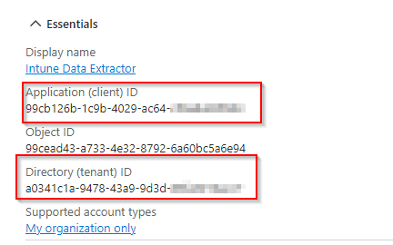
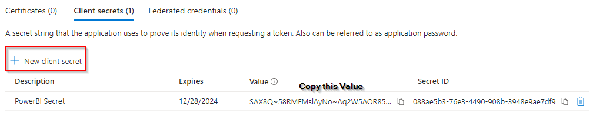
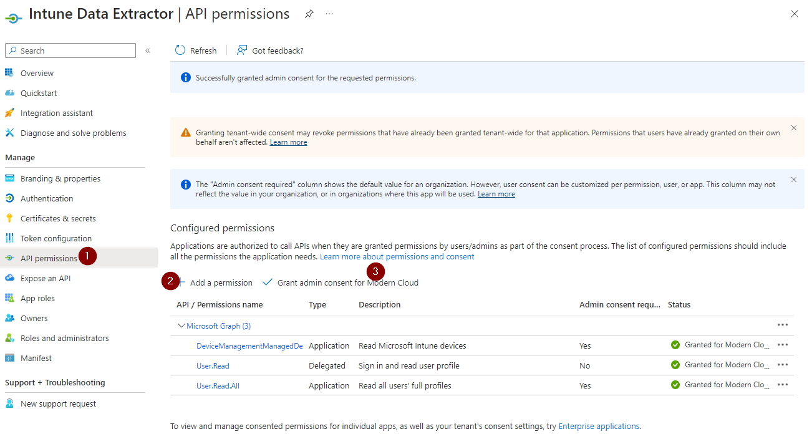
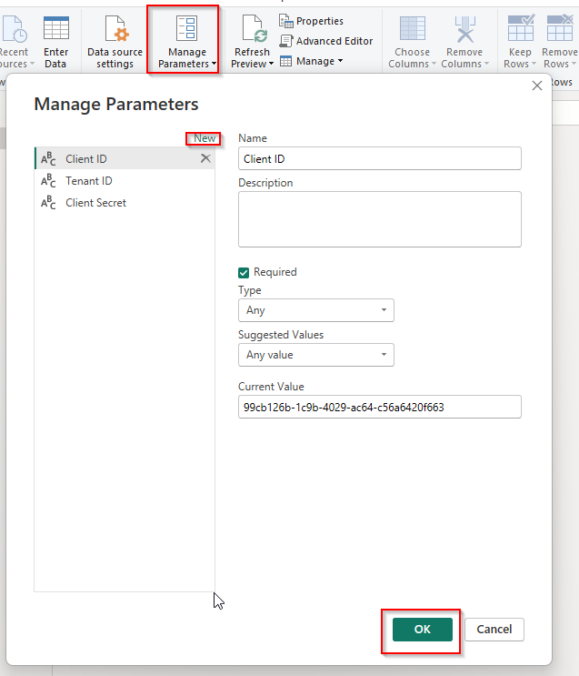

# Intune Data Extractor with Power BI

This project describes how to set up a connection between Power BI and Microsoft Graph API to retrieve data from Intune.

## Prerequisites

- A Microsoft Azure subscription
- Administrator access to Azure Active Directory
- Power BI Desktop installed on your computer

## Step 1: Create an App Registration in Azure

1. Log in to the [Entra Portal][(https://entra.microsoft.com/).
2. Navigate to "Application" > "App registrations".
3. Click on "New registration".
4. Give the app a name, e.g., "Intune Data Extractor".
5. Under Supported account types, select "Accounts in this organizational directory only".
6. Click "Register".
     
   
   
9. On the app's overview page, note down the following information:
   - Application (client) ID
   - Directory (tenant) ID
10. Go to "Certificates & secrets" and create a new client secret. Copy and save this immediately, as it won't be shown again.

## Step 2: Configure API Permissions

1. In your app registration, go to "API permissions".
2. Click on "Add a permission".
3. Select "Microsoft Graph".
4. Choose "Application permissions".
5. Add the following permissions:
   - DeviceManagementManagedDevices.Read.All
   - User.Read.All
6. Click on "Grant admin consent" when you're done.

## Step 3: Create a Power Query

1. Open Power BI Desktop.
2. Click on "Get Data" and select "Blank Query".
3. In Power Query Editor, go to "Manage Parameters" and create the following parameters:
   - Client ID
   - Client Secret
   - Tenant ID
4. In the Power Query Editor, click on New Source and "Blank Query".
5. In the Advanced Editor window, paste the query code. The code can be found in the `IntuneDateExtractor.pq` file in this repository. 

## Step 4: Configure Power BI Connection

After pasting the query into the Advanced Editor in Power BI:

1. You may see a prompt asking you to specify how to connect. Click "Edit Credentials".
2. In the "Access Web content" dialog for https://login.windows.net/:
   - Select "Anonymous" as the authentication method.
   - Click "Connect".
3. In the "OData feed" dialog for https://graph.microsoft.com/beta/users:
   - Select "Anonymous" as the authentication method.
   - Ensure the correct level (https://graph.microsoft.com/) is selected.
   - Click "Connect".
4. You may see a privacy levels warning. If so:
   - Click "Continue".
   - In the "Privacy levels" dialog, check the box next to "Ignore Privacy Levels checks for this file".
   - Click "Save".
5. Power BI will now attempt to load the data. If successful, you should see your user and device data in the query editor.

Note: Ignoring privacy levels could potentially expose sensitive data. Ensure you understand the implications and have appropriate security measures in place in your Power BI environment.
